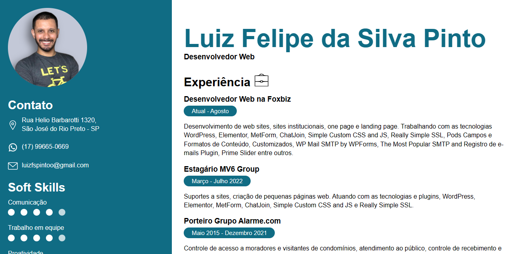

<h1 align="center">Currículo</h1>

Meu currículo foi desenvolvido a partir dos conceitos básicos de Desenvolvimento Web. 

  

## Demo
https://curriculo.lzfelipe.dev/

## 🚀 Tecnologias

Esse projeto foi desenvolvido com as seguintes tecnologias:

- HTML
- CSS

## 💻 Projeto

Meu currículo é um cartão de visitas, para empresas e usuários do Github.
