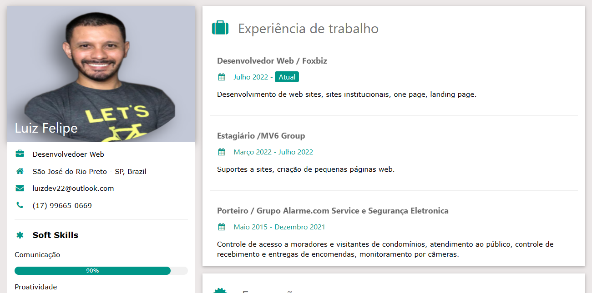

<h1 align="center">Projeto Currículo</h1>

Projeto desenvolvido baseado no template de CV da W3.Schools. 

  <a href="#-tecnologias">Tecnologias</a>&nbsp;&nbsp;&nbsp;|&nbsp;&nbsp;&nbsp;
  <a href="#-projeto">Projeto</a>

  

## 🚀 Tecnologias

Esse projeto foi desenvolvido com as seguintes tecnologias:

- HTML, CSS e framework W3.CSS
- Git e Github

## 💻 Projeto

O Projeto Currículo é um agregador de cv para usar como cartão de visitas para empresas visualizarem perfil profissional.